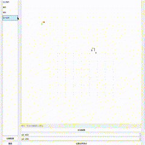
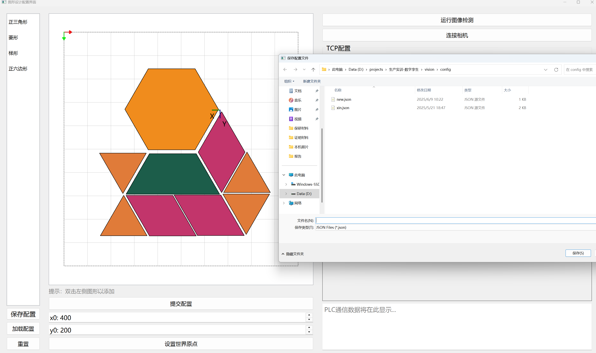

# BK-Vision
2025北京科技大学生产实训：数字孪生项目视觉软件

## Setup

1. **安装SAM1环境，repo：[segment-anything](https://github.com/facebookresearch/segment-anything)**

   ```bash
   git clone git@github.com:facebookresearch/segment-anything.git
   cd segment-anything; pip install -e .
   ```

2. **下载轻量级模型权重，vit_b: [ViT-B SAM model.](https://dl.fbaipublicfiles.com/segment_anything/sam_vit_b_01ec64.pth)到vision/weights**

3. **安装其他依赖：**

   ```bash
   pip install -r .\requirements.txt
   ```

4. **运行程序：**

     ```bash
   python BK_Vision.py
   ```


## Overview


图形配置的基本功能包括：

①画布坐标系到世界坐标系的变换：更改世界坐标原点在画布的位置


②人机交互逻辑：双击添加、左键拖动、右键旋转



③常用配置的一键加载：将已有的配置文件导入画布


④导出画布配置：将当前画布的配置图形保存为.json方便使用


